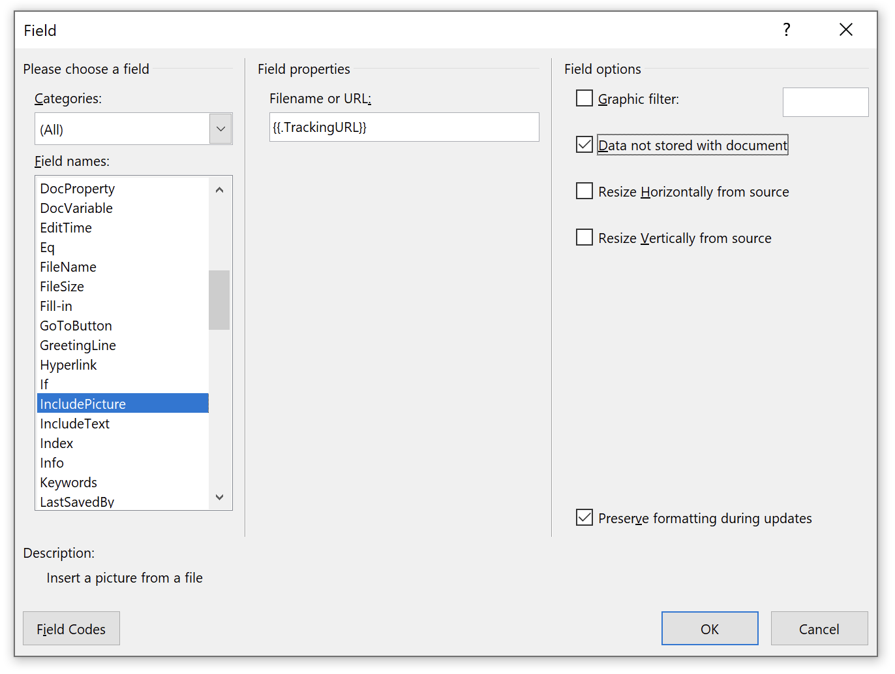
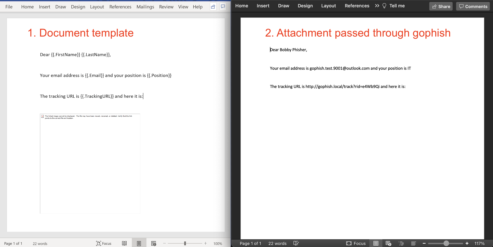

# Отслеживание вложений

В Gophish возможно добавлять [переменные шаблона](https://docs.getgophish.com/user-guide/template-reference) в содержимое определенных типов файлов вложений. Поддерживаются следующие типы файлов:

| Тип          | Расширение     | Пример шаблона     |
| ------------- |:-------------:| :-------------:|
| Документ Word      | .docx | [gophish_word.docx](example-attachments/gophish_word.docx) |
| Документ Word с поддержкой макросов | .docm|  [gophish_word_macro.docm](example-attachments/gophish_word_macro.docm) |
| Презентация PowerPoint | .pptx| [gophish_powerpoint.pptx](example-attachments/gophish_powerpoint.pptx) |
| Документ Excel | .xlsx | [gophish_excel.xlsx](example-attachments/gophish_excel.xlsx) |
| Документ Excel с поддержкой макросов | .xlsm | [gophish_excel_macro.xlsm](example-attachments/gophish_excel_macro.xlsm) |
| Текстовый файл | .txt | [gophish_text.txt](example-attachments/gophish_text.txt) |
| HTML-файл | .html | [gophish_html.html](example-attachments/gophish_html.html) |
| Файл календаря | .ics | [gophish_invite.ics](example-attachments/gophish_invite.ics) |    

Любые переменные шаблона, размещенные внутри этих документов, будут преобразованы в соответствующие значения при запуске кампании. Добавление отслеживающих изображений в документы Office может обеспечить уведомление о том, что документ был открыт или что макросы были включены.

Если вы просто хотите быстро начать работу, используйте приведенные выше шаблоны. Продолжайте читать ниже, если вам интересно, как были созданы эти примеры (особенно документы Office, которые более сложные).

---

## Примеры с обычным текстом
Ниже приведен .txt файл с несколькими переменными:

`foo.txt`
```
Здравствуйте, {{.FirstName}},
Это обычный текстовый файл, который был отправлен на {{.Email}}. Если вы можете скопировать и вставить этот URL в свой браузер: {{.URL}}
```

Как видно, это не сразу полезно, но, возможно, есть некоторые сценарии, когда шаблонизация текстового файла полезна. Ниже приведена часть файла приглашения календаря .ics:

`invite.ics`
```
BEGIN:VCALENDAR
DTSTAMP:20210306T182251Z
DTSTART;TZID=Europe/London:20210306T183000
DTEND;TZID=Europe/London:20210306T190000
SUMMARY:Gophish Test Calendar
TZID:Europe/London
DESCRIPTION:Glenn приглашает вас на встречу Zoom.
 n\nПрисоединиться к встрече Zoom\n{{.URL}}
LOCATION:{{.URL}}
END:VCALENDAR
```


## Примеры документов Office
Более полезный случай использования этой функциональности, вероятно, — отслеживание документов Microsoft Office, особенно условий (i) открытия документа и (ii) включения макросов. Gophish поддерживает несколько форматов Office, но подход в основном одинаков.

### Отслеживание открытия документа Office
Мы можем добавить переменную `{{.TrackingURL}}` в документ Office как "связанное изображение". Когда документ открывается, Word/Excel/PowerPoint попытается загрузить изображение, тем самым обращаясь к серверу Gophish и отмечая документ как открытый (убедитесь, что Tracking URL не включен в письмо, так как на данном этапе существует только одна конечная точка для обозначения 'Открыто'). Для достижения этого можно использовать следующие шаги:

1. Создайте новый документ
2. Выберите вкладку `Insert` (Вставка), затем нажмите `Quick Parts` (Экспресс-блоки) и затем `Field` (Поле)


3. Прокрутите вниз слева и выберите `IncludePicture`. В поле ввода имени файла или URL введите `{{.TrackingURL}}` и отметьте флажок `Data not stored with document` (Данные не сохраняются вместе с документом) справа (или в документе Word нажмите Alt+F9 для переключения кодов полей и вставьте `INCLUDEPICTURE  "{{.TrackingURL}}" \d`):




4. Если вы хотите включить переменные шаблона (например, `{{.FirstName}}`) в тело документа Word, вам нужно отключить проверку грамматики и орфографии (иначе Word вставляет proofErrors в середину имен переменных). Выберите File > Options > Proofing (Файл > Параметры > Правописание) и снимите отметки с `Check spelling as you type` (Проверять орфографию при вводе) и `Mark grammar errors as you type` (Отмечать грамматические ошибки при вводе). 

На изображении ниже показан шаблонный файл Word слева и результат после прохождения через Gophish в качестве вложения кампании и открытия пользователем-целью справа.




### Отслеживание выполнения макросов в документах Office
Чтобы отследить, были ли включены макросы пользователем, нам нужен код макроса, который обращается к переменной шаблона Gophish (например, `{{.TrackerURL}}`) или обращается к конечной точке Gophish (например, `{{.URL}}`). Сосредоточившись на последнем варианте, мы хотели бы, чтобы код макроса обращался, например, к https://myphishingserver.com/?rid=aBC12345. Существует много разных способов сделать это, но простая вставка переменных Gophish в код макроса не работает, так как программно редактировать код макроса нетривиально (он упакован в бинарном формате). Решение, которое мы придумали, заключалось в том, чтобы вставить текстовое поле в документ с переменными и ссылаться на это текстовое поле из кода макроса. Вот шаги:

1. Создайте новый документ
2. Создайте текстовое поле с содержимым `{{.URL}}`
3. Назовите текстовое поле "`urlbox`", выбрав текстовое поле и следуя инструкциям ниже:
  
  Windows: Home > Editing > Select > Selection Pane (Главная > Редактирование > Выбрать > Панель выбора)
  
  Mac: Shape Format > Arrange > Selection Pane (Формат фигуры > Упорядочить > Панель выбора)

4. Добавьте следующий код макроса в документ (F11):

```
Sub urlfetch()
 Dim shp As Shape

 For Each shp In ActiveDocument.Shapes
    If shp.Name = "urlbox" Then
        URL = shp.TextFrame.TextRange.Text
        ActiveDocument.FollowHyperlink Address:=URL
    End If
 Next
End Sub

Public Sub AutoOpen()
    urlfetch
End Sub

```

или для Excel:
```
Sub urlfetch()
  For Each shp In ActiveSheet.Shapes
    If shp.Name = "urlbox" Then
        Url = shp.TextFrame2.TextRange.Text
        FollowHyperlink (Url)
    End If
  Next
End Sub

Public Sub Workbook_Open()
    urlfetch
End Sub
```

4. Сохраните и выйдите

Когда документ будет открыт, пользователю будет предложено включить макросы. Если они это сделают, будет открыт `{{.URL}}`. Это позволяет показать пользователю страницу, информирующую о том, что он стал жертвой фишинговой кампании.
  
(Примечание: В будущем было бы более аккуратно использовать метод `Application.Documents.CanCheckOut (URL)`, но это запрос HEAD, который требует некоторой модификации кода Gophish для обработки нажатия на ссылку)